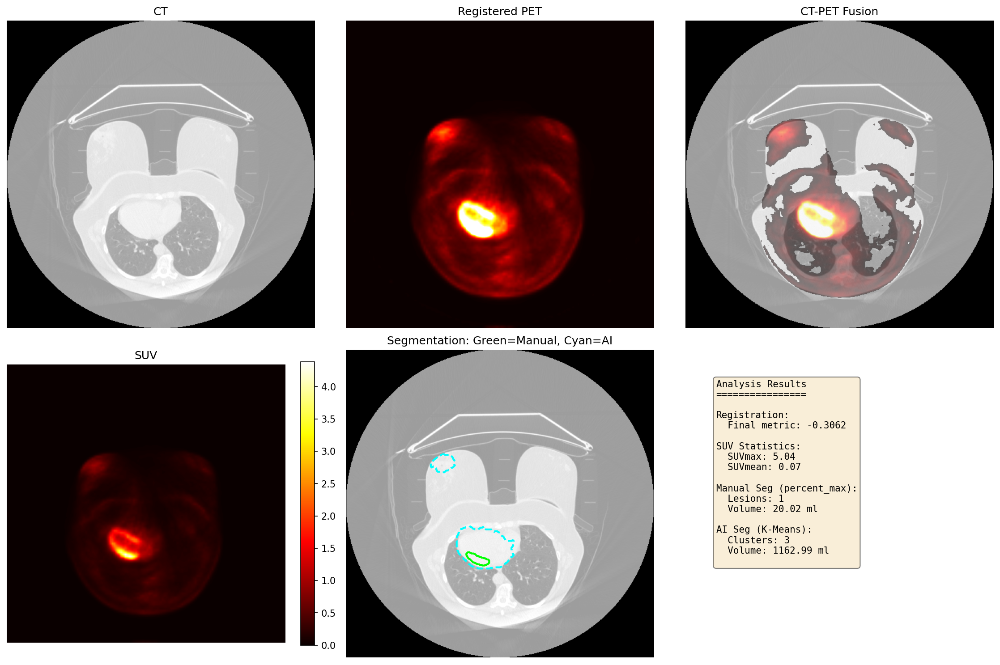
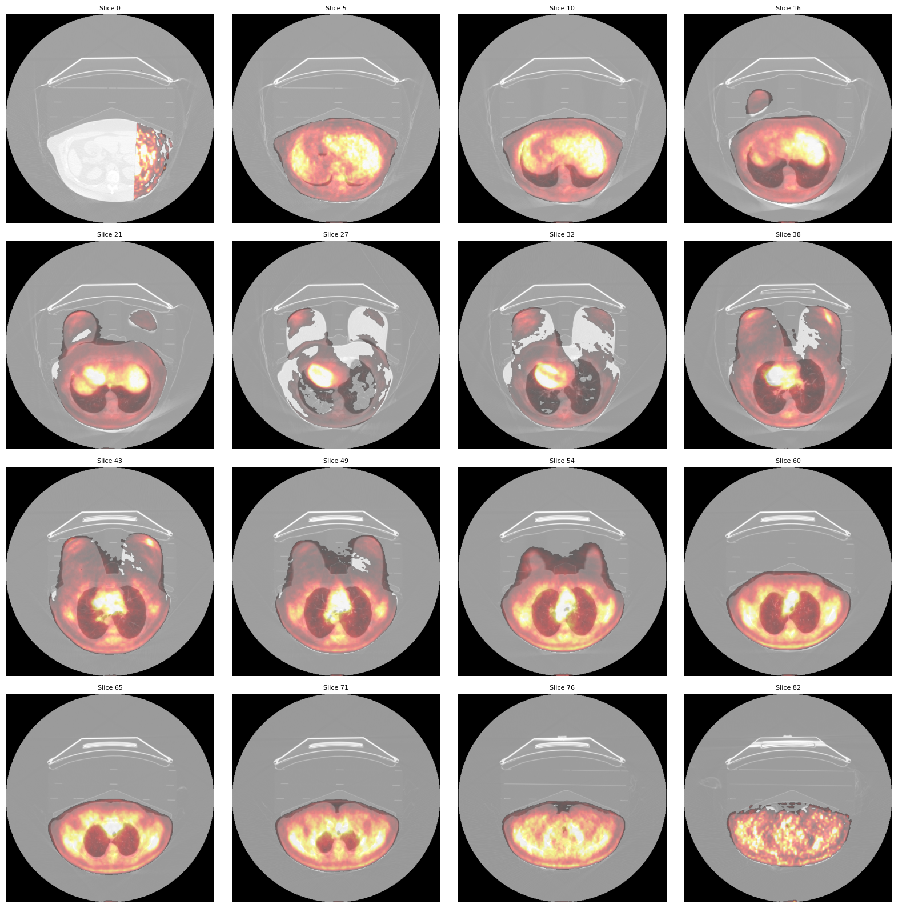

# 🎗️ AI Driven Multimodel Image Registration for Breast Cancer


A comprehensive Python toolkit for the automatic registration, fusion, and AI-driven analysis of multimodal (CT/PET) breast cancer imaging data.

## 📋 Overview

This project provides an end-to-end pipeline for processing medical images, specifically designed for breast cancer diagnosis and research. It bridges anatomical data (CT) with metabolic data (PET) to provide precise tumor localization and quantitative analysis.

Key capabilities include **rigid & affine image registration**, **Standardized Uptake Value (SUV) calculation**, and **Unsupervised AI segmentation** to automatically identify potential lesions.

## ✨ Key Features

- **🔄 Robust Image Registration**
  - Multi-stage alignment (Center of Mass → Rigid → Affine).
  - Uses Mutual Information metric for accurate multimodal fusion.
  - Corrects patient positioning errors and scanner misalignments.

- **🤖 AI-Driven Segmentation**
  - **Unsupervised K-Means Clustering**: Automatically separates tumor, soft tissue, and background without manual thresholding.
  - Fuses CT density and PET metabolic activity for superior tissue classification.

- **📊 Quantitative SUV Analysis**
  - Calculates **SUVbw** (Body Weight), **SUVlbm** (Lean Body Mass), and **SUVbsa**.
  - Computes critical metrics: $SUV_{max}$, $SUV_{mean}$, $SUV_{peak}$, and Total Lesion Glycolysis (TLG).

- **🖼️ Advanced Visualization**
  - Interactive slice navigation.
  - Multi-planar reconstruction (Axial, Coronal, Sagittal).
  - 3D volume montages.
  - Publication-quality fusion overlays.

## 📄 Example Outputs

### 1. Automated Analysis Dashboard
The pipeline generates a comprehensive dashboard for each patient, visualizing the core steps of the analysis:



- **Registration Review (Top Row)**: 
  - **CT (Left)**: Anatomical reference.
  - **Registered PET (Right)**: Metabolic activity map aligned to the CT coordinate space.
  - **Fusion (Right)**: Overlay of PET on CT, verifying alignment accuracy.
- **Quantitative Analysis (Bottom Row)**:
  - **SUV Map**: Standardized Uptake Value heatmap.
  - **Tumor Segmentation**: Comparison of **Manual (Green)** vs. **AI-Driven (Cyan)** segmentation contours.
  - **Metrics Panel**: Instant readout of registration quality (Mutual Information), SUV statistics, and tumor volume.

### 2. 3D Volume Montage
A multi-slice view across the axial plane allows for rapid assessment of tumor extent and registration consistency throughout the volume.



## 🛠️ Technology Stack

- **Core Imaging**: `SimpleITK`, `nibabel`
- **Data Science**: `numpy`, `scipy`
- **Machine Learning**: `scikit-learn`
- **Visualization**: `matplotlib`

## 🚀 Installation

1.  **Clone the repository**
    ```bash
    git clone https://github.com/yourusername/breast-cancer-registration.git
    cd breast-cancer-registration
    ```

2.  **Create a virtual environment (Recommended)**
    ```bash
    python -m venv venv
    # Windows
    venv\Scripts\activate
    # Linux/Mac
    source venv/bin/activate
    ```

3.  **Install dependencies**
    ```bash
    pip install -r requirements.txt
    ```

## 💻 Usage

### Automated Pipeline
Run the full analysis pipeline on a patient dataset. This will perform registration, SUV calculation, AI segmentation, and report generation in one go.

```bash
python pipeline.py "data/patients/patient01" --weight 70
```

**Arguments:**
- `patient_path`: Path to the patient directory containing `ct.nii.gz` and `pet.nii.gz`.
- `--weight` / `-w`: Patient weight in kg (required for accurate SUV calculation).
- `--output` / `-o`: (Optional) Custom output directory.

### using Python Modules
You can import individual modules for custom workflows:

```python
from src.registration import ImageRegistration, load_image
from src.ml_segmentation import MLTumorSegmentor

# Load images
ct = load_image("data/patient01/ct.nii.gz")
pet = load_image("data/patient01/pet.nii.gz")

# 1. Register
registrar = ImageRegistration()
transform = registrar.register(ct, pet, "rigid")
pet_reg = registrar.apply_transform(ct, pet, transform)

# 2. AI Segmentation
segmentor = MLTumorSegmentor(n_clusters=3)
result = segmentor.segment(ct, pet_reg)

print(f"Tumor Cluster ID: {result.tumor_cluster_id}")
```

## 📂 Project Structure

```
├── 📁 data/                 # Patient datasets
├── 📁 src/                  # Source code
│   ├── ml_segmentation.py   # K-Means clustering logic
│   ├── registration.py      # Rigid/Affine registration
│   ├── segmentation.py      # Threshold-based segmentation
│   ├── suv.py               # SUV calculation engine
│   └── visualization.py     # Plotting utilities
├── pipeline.py              # Main execution script
├── requirements.txt         # Dependencies
└── README.md                # Project documentation
```

## 📄 Output & Results

The pipeline generates a `output/` folder containing:
- **`pet_registered.nii.gz`**: PET volume aligned to CT coordinates.
- **`tumor_mask_ai.nii.gz`**: Binary mask of the AI-detected tumor.
- **`analysis_report.png`**: Visual dashboard showing fusion and segmentation.
- **`report.json`**: JSON file with all quantitative metrics (Registration error, SUV stats, Tumor volume).

## 🤝 Contributing

Contributions are welcome! Please feel free to submit a Pull Request.

## 📜 License

This project is licensed under the MIT License - see the LICENSE file for details.
